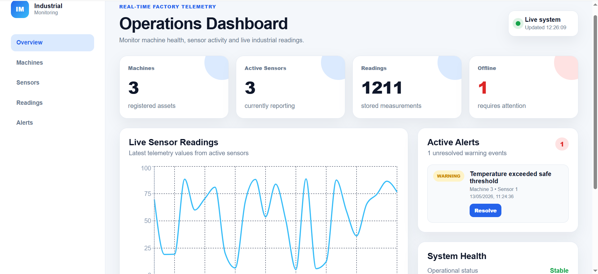
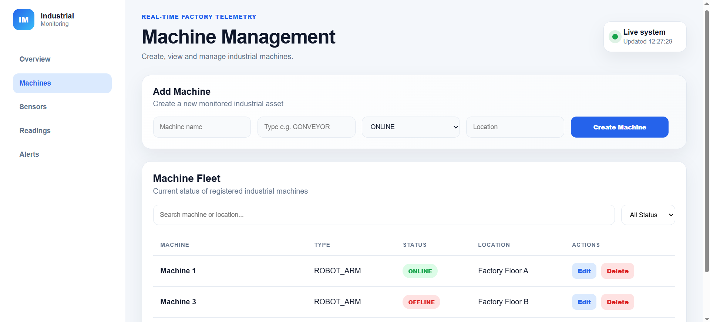
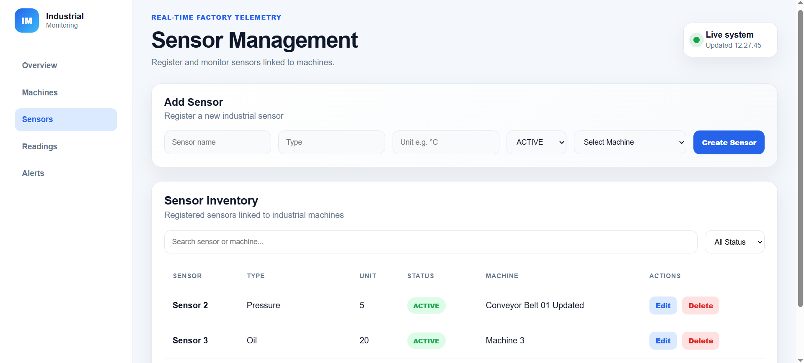

# Industrial Monitoring Platform

A full-stack industrial monitoring platform built with **Spring Boot**, **PostgreSQL**, **Docker** and **React**.

This project simulates a real-world factory monitoring system where industrial machines, sensors, telemetry readings and alerts are managed through a modern dashboard.

---

## Overview

The goal of this project is to demonstrate a complete full-stack application with:

- backend architecture
- REST APIs
- database relationships
- authentication
- real-time-like monitoring
- dashboard UI
- Dockerized environment

The platform includes automatic sensor reading generation, alert detection, alert resolution, CRUD operations and JWT-based authentication.

---

## Tech Stack

### Backend

- Java 25
- Spring Boot
- Spring Data JPA
- Hibernate
- PostgreSQL
- Spring Security
- JWT Authentication
- BCrypt password hashing
- Maven
- Docker

### Frontend

- React
- Vite
- Axios
- Recharts
- CSS
- Docker

### Database

- PostgreSQL

---

## Features

### Authentication

- Login system
- JWT token generation
- Protected API endpoints
- Token persistence in frontend
- Logout
- BCrypt password hashing
- Demo admin user created automatically

Demo credentials:

```txt
username: admin
password: admin123
```

---

### Dashboard

- Overview page
- Statistics cards
- Live system status
- Latest sensor readings chart
- Active alerts panel
- Auto-refresh every 5 seconds

---

### Machines

- Create machines
- View machine list
- Edit machines
- Delete machines
- Search machines
- Filter by status
- Machine detail page
- Linked sensors per machine

Machine statuses:

```txt
ONLINE
WARNING
OFFLINE
```

---

### Sensors

- Create sensors
- View sensor inventory
- Edit sensors
- Delete sensors
- Search sensors
- Filter by status
- Link sensors to machines

Sensor statuses:

```txt
ACTIVE
INACTIVE
```

---

### Readings

- Automatic reading generation
- Historical telemetry storage
- Readings chart
- Paginated readings table

---

### Alerts

- Automatic alert generation based on sensor thresholds
- Prevent duplicate active alerts
- Resolve alerts manually
- Active alerts page
- Alert counter

---

## System Architecture

```txt
Machine
 └── Sensors
      ├── Sensor Readings
      └── Alerts
```

Main backend flow:

```txt
Controller -> Service -> Repository -> PostgreSQL
```

Main frontend flow:

```txt
React Components -> Axios API Calls -> Spring Boot API
```

---

## Docker Setup

The project is fully Dockerized.

### Run the full application

```bash
docker compose up --build
```

This starts:

| Service | URL |
|---|---|
| Frontend | http://localhost:5173 |
| Backend | http://localhost:8080 |
| PostgreSQL | localhost:5432 |

---

### Stop containers

```bash
docker compose down
```

---

### Reset database data

```bash
docker compose down -v
```

Then run again:

```bash
docker compose up --build
```

The demo admin user will be recreated automatically.

---

## Manual Backend Setup

If running without Docker:

```bash
cd backend
./mvnw spring-boot:run
```

On Windows:

```powershell
cd backend
.\mvnw.cmd spring-boot:run
```

Backend runs on:

```txt
http://localhost:8080
```

---

## Manual Frontend Setup

```bash
cd frontend
npm install
npm run dev
```

Frontend runs on:

```txt
http://localhost:5173
```

---

## API Endpoints

### Authentication

```txt
POST /api/auth/register
POST /api/auth/login
```

---

### Dashboard

```txt
GET /api/dashboard
```

---

### Machines

```txt
GET    /api/machines
POST   /api/machines
PUT    /api/machines/{id}
DELETE /api/machines/{id}
```

---

### Sensors

```txt
GET    /api/sensors
POST   /api/sensors
PUT    /api/sensors/{id}
DELETE /api/sensors/{id}
```

---

### Readings

```txt
GET /api/readings
GET /api/sensors/{sensorId}/readings
```

---

### Alerts

```txt
GET /api/alerts
PUT /api/alerts/{id}/resolve
```

---

## Screenshots

### Dashboard



### Machines



### Sensors



---

## What I Learned

This project helped me practice and understand:

- Spring Boot architecture
- REST API development
- PostgreSQL integration
- JPA/Hibernate relationships
- Cascade delete
- DTO usage
- Validation
- Exception handling
- JWT authentication
- BCrypt password hashing
- React component architecture
- API integration with Axios
- Dashboard UI design
- Docker and docker-compose
- Full-stack project organization

---

## Future Improvements

Possible next improvements:

- WebSocket real-time updates
- Deployment to cloud
- Role-based access control
- Admin/user permissions
- Export readings to CSV
- Dark/light mode toggle
- Advanced analytics
- Email or notification alerts
- Unit and integration tests
- CI/CD pipeline

---

## Project Status

The project is currently fully functional locally with Docker.

Current version includes:

- Dockerized frontend
- Dockerized backend
- Dockerized PostgreSQL
- JWT authentication
- CRUD for machines and sensors
- Alert system
- Sensor simulator
- Dashboard UI

---

## Author

**Filipe Néri**

Student project focused on full-stack development, industrial monitoring and backend architecture.